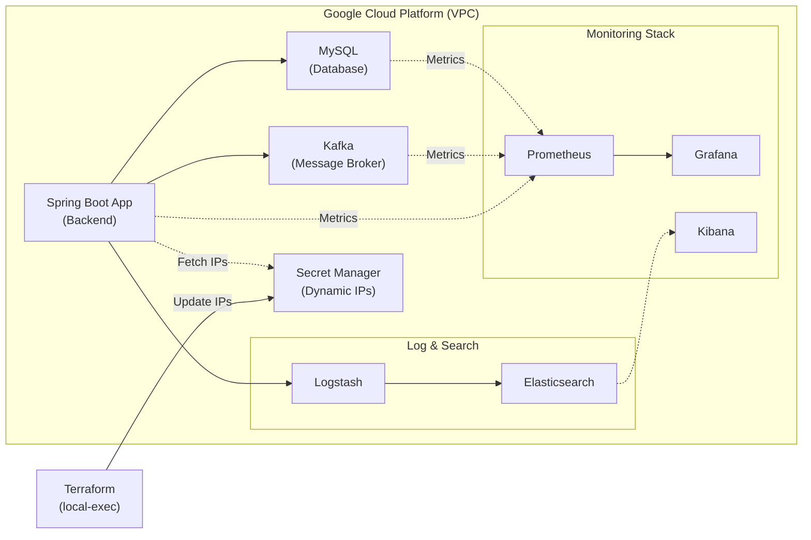

# Lesson Matching Platform - Infrastructure (Terraform)

이 레포지토리는 **Lesson Matching Platform**의 백엔드 인프라를 Google Cloud Platform(GCP) 상에 자동으로 구축하기 위한 **Terraform (IaC)** 코드입니다. 

## 🏗️ Architecture & Services
본 인프라 코드는 다음과 같은 마이크로서비스 및 모니터링/로그 생태계를 단일 VPC 내에 구축합니다.



- **Spring Boot Application**: 핵심 비즈니스 로직 처리 서버
- **MySQL**: 메인 관계형 데이터베이스
- **Kafka**: 비동기 메시지 브로커 (이벤트 처리용)
- **Elasticsearch & Logstash**: 통합 검색 엔진 및 로그 수집 파이프라인
- **Monitoring (Prometheus, Grafana, Kibana)**: 시스템 메트릭 수집 및 시각화 대시보드

**[핵심 자동화 기능]**
인프라(VM) 생성이 완료되면 `local-exec` provisioner를 통해 **GCP Secret Manager**에 생성된 인프라의 퍼블릭/프라이빗 IP가 자동으로 등록/갱신됩니다. 이를 통해 애플리케이션(Spring)이 별도의 수동 설정 없이 최신 데이터베이스 및 카프카 IP를 동적으로 가져올 수 있습니다.

---

## 🚀 시작하기 전 준비사항 (Prerequisites)

이 코드를 실행하기 전에 아래 도구들이 설치되어 있어야 합니다.

1. **[Terraform](https://developer.hashicorp.com/terraform/downloads)** (v1.x 이상)
2. **[Google Cloud CLI (`gcloud`)](https://cloud.google.com/sdk/docs/install)**
3. GCP 프로젝트 생성 및 결제 계정 연동
4. GCP Secret Manager API 활성화

### GCP 인증 설정
로컬 터미널에서 아래 명령어를 통해 GCP에 로그인하고 기본 인증 정보를 세팅합니다.
```bash
gcloud auth login
gcloud auth application-default login
gcloud config set project <본인의_GCP_PROJECT_ID>
```

---

## ⚙️ 설정 가이드 (Configuration)

보안을 위해 민감한 변수들은 깃허브에 공유되지 않습니다. (`.gitignore` 적용됨)
사용하기 위해서는 로컬에 직접 `terraform.tfvars` 파일을 생성하고 아래 양식에 맞게 본인의 환경값을 입력해야 합니다.

**`terraform.tfvars` 파일 생성 및 작성:**
```hcl
# GCP 프로젝트 ID
project_id = "your-gcp-project-id"

# GCP 리전 (기본값 추천: asia-northeast3)
region = "asia-northeast3"

# 인스턴스에 접속할 SSH 계정 이름 (내 컴퓨터의 사용자 이름 추천)
username = "your_ssh_username"

# VM에 할당될 GCP 서비스 계정 이메일
service_account_email = "your-service-account@your-gcp-project-id.iam.gserviceaccount.com"
```

---

## 🛠️ 배포 및 실행 방법 (Usage)

1. **테라폼 초기화** (플러그인 및 프로바이더 다운로드)
   ```bash
   terraform init
   ```

2. **인프라 변경사항 미리보기**
   ```bash
   terraform plan
   ```

3. **인프라 실제 구축 및 배포**
   ```bash
   terraform apply
   ```
   *프롬프트가 나타나면 `yes`를 입력하여 승인합니다. 인프라 구축에는 수 분이 소요될 수 있습니다.*

4. **리소스 삭제 (종료 시)**
   과금을 방지하기 위해 사용이 끝난 후에는 반드시 인프라를 삭제해야 합니다.
   ```bash
   terraform destroy
   ```

---

## 🔒 보안 및 주의사항
- `terraform.tfvars`와 `.tfstate` 파일에는 인프라의 민감한 IP 및 구성 정보가 포함되어 있으므로 **절대 원격 레포지토리(GitHub 등)에 커밋하지 마세요.**
- 현재 `firewall.tf`에 의해 일부 서비스의 포트가 전체(`0.0.0.0/0`)로 열려 있습니다. 실 서비스(Production) 환경에 배포할 때는 반드시 내부 VPC 통신이나 로드밸런서를 통한 접속만 허용하도록 **보안 규칙을 엄격하게 수정**해야 합니다.
