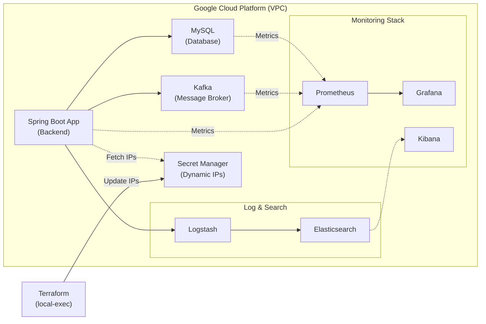

# Lesson Matching Platform - Infrastructure (Terraform)

이 레포지토리는 **Lesson Matching Platform**의 백엔드 인프라를 Google Cloud Platform(GCP) 상에 자동으로 구축하기 위한 **Terraform (IaC)** 코드입니다. 

## 🏗️ Architecture & Services
본 인프라 코드는 다음과 같은 마이크로서비스 및 모니터링/로그 생태계를 단일 VPC 내에 구축합니다.



- **Spring Boot Application**: 핵심 비즈니스 로직 처리 서버
- **MySQL**: 메인 관계형 데이터베이스
- **Kafka**: 비동기 메시지 브로커 (이벤트 처리용)
- **Elasticsearch & Logstash**: 통합 검색 엔진 및 로그 수집 파이프라인
- **Monitoring (Prometheus, Grafana, Kibana)**: 시스템 메트릭 수집 및 시각화 대시보드

**[핵심 자동화 기능]**
인프라(VM) 생성이 완료되면 `local-exec` provisioner를 통해 **GCP Secret Manager**에 생성된 인프라의 퍼블릭/프라이빗 IP가 자동으로 등록/갱신됩니다. 이를 통해 애플리케이션(Spring)이 별도의 수동 설정 없이 최신 데이터베이스 및 카프카 IP를 동적으로 가져올 수 있습니다.

---

## 🤔 기술적 의사 결정 (Tech Decisions)

### 1. 왜 쿠버네티스(GKE)가 아닌 단일 VM(Compute Engine)을 선택했는가?
- **기초 인프라와 네트워크 통신 원리 파악**: 추상화 수준이 높은 Managed Kubernetes 환경 대신, 원시 VM을 직접 프로비저닝하고 Docker/Docker-compose를 통해 컨테이너를 관리함으로써 리눅스 운영체제, 네트워크 방화벽(VPC/Subnet), 데몬 서비스의 동작 원리를 깊이 있게 이해하고자 했습니다.
- **비용 효율성 및 오버헤드 최소화**: 개인 프로젝트(포트폴리오) 수준의 트래픽 규모에서는 K8s 클러스터 유지 비용과 관리 오버헤드가 불필요하게 크다고 판단하여, 단일 VM 기반의 독립적인 인프라 아키텍처를 구성했습니다. (향후 트래픽 증가 시 MIG나 K8s로의 마이그레이션 가능성을 열어두었습니다.)

### 2. 왜 로컬 파일이 아닌 Secret Manager를 사용해 IP를 관리하는가?
- **인프라와 애플리케이션 계층의 결합도 감소**: 테라폼이 동적으로 할당된 인프라 IP를 애플리케이션 환경변수 파일(.env 등)에 직접 주입하게 되면 관리가 복잡해집니다. Secret Manager를 중앙 저장소로 활용함으로써, 테라폼은 배포 후 IP만 업데이트하고 Spring 애플리케이션은 시작 시 동적으로 IP를 읽어오는 **느슨한 결합(Loose Coupling)**을 달성했습니다.
- **보안성(Security) 강화**: 데이터베이스, 카프카 등 핵심 인프라의 엔드포인트 주소나 자격 증명이 코드나 로컬 파일에 평문으로 남지 않아 보안 사고를 사전에 방지할 수 있습니다.

### 3. 왜 모니터링 시스템으로 Prometheus + Grafana를 구성했는가?
- **Pull 방식의 메트릭 수집 강점**: 모니터링 대상 서비스가 중앙 서버로 데이터를 억지로 밀어넣는 Push 방식 대신, Prometheus 서버가 주기적으로 각 인스턴스의 엔드포인트(`/metrics`)에서 데이터를 긁어오는(Pull) 방식을 채택하여 서비스들의 부하 및 의존성을 최소화했습니다.
- **강력한 가시성과 생태계(Ecosystem)**: MySQL Exporter, Kafka Exporter, Node Exporter 등 각 컴포넌트에 특화된 Exporter를 활용하고, 이를 Grafana의 방대한 커뮤니티 대시보드와 결합하여 인프라 전반의 가시성을 직관적이고 빠르게 확보할 수 있었습니다.

---

## 📂 디렉토리 구조 (Directory Structure)
이 레포지토리는 코드의 재사용성과 유지보수성을 극대화하기 위해 테라폼 **모듈(Module) 패턴**을 채택하여 구성되었습니다.

```text
📦 terraform
 ┣ 📂 modules/
 ┃ ┣ 📂 spring/        # Spring Boot 애플리케이션 서버 프로비저닝
 ┃ ┣ 📂 mysql/         # 메인 데이터베이스 서버 구성
 ┃ ┣ 📂 kafka/         # 메시지 브로커 (Kafka, Zookeeper) 서버 구성
 ┃ ┣ 📂 elasticsearch/ # 검색 엔진(Elasticsearch) 및 로그 수집기(Logstash) 구성
 ┃ ┣ 📂 monitoring/    # 모니터링 스택 (Prometheus, Grafana, Kibana) 구성
 ┃ ┗ 📂 common/        # 각 VM에서 공통으로 사용되는 초기화 스크립트 모음 (Docker 설치, 계정 생성 등)
 ┣ 📜 main.tf          # 전체 모듈을 조립하고 배포 순서(depends_on) 및 IP 주입 파이프라인을 정의하는 메인 파일
 ┣ 📜 firewall.tf      # 서비스 간 통신을 위한 네트워크 방화벽(Firewall) 규칙 정의
 ┣ 📜 variables.tf     # 전역 변수 선언 (설명 및 타입 정의)
 ┗ 📜 provider.tf      # GCP 연동을 위한 클라우드 프로바이더 설정
```

---

## 🚀 시작하기 전 준비사항 (Prerequisites)

이 코드를 실행하기 전에 아래 도구들이 설치되어 있어야 합니다.

1. **[Terraform](https://developer.hashicorp.com/terraform/downloads)** (v1.x 이상)
2. **[Google Cloud CLI (`gcloud`)](https://cloud.google.com/sdk/docs/install)**
3. GCP 프로젝트 생성 및 결제 계정 연동
4. GCP Secret Manager API 활성화

### GCP 인증 설정
로컬 터미널에서 아래 명령어를 통해 GCP에 로그인하고 기본 인증 정보를 세팅합니다.
```bash
gcloud auth login
gcloud auth application-default login
gcloud config set project <본인의_GCP_PROJECT_ID>
```

---

## ⚙️ 설정 가이드 (Configuration)

보안을 위해 민감한 변수들은 깃허브에 공유되지 않습니다. (`.gitignore` 적용됨)
사용하기 위해서는 로컬에 직접 `terraform.tfvars` 파일을 생성하고 아래 양식에 맞게 본인의 환경값을 입력해야 합니다.

**`terraform.tfvars` 파일 생성 및 작성:**
```hcl
# GCP 프로젝트 ID
project_id = "your-gcp-project-id"

# GCP 리전 (기본값 추천: asia-northeast3)
region = "asia-northeast3"

# 인스턴스에 접속할 SSH 계정 이름 (내 컴퓨터의 사용자 이름 추천)
username = "your_ssh_username"

# VM에 할당될 GCP 서비스 계정 이메일
service_account_email = "your-service-account@your-gcp-project-id.iam.gserviceaccount.com"
```

---

## 🛠️ 배포 및 실행 방법 (Usage)

1. **테라폼 초기화** (플러그인 및 프로바이더 다운로드)
   ```bash
   terraform init
   ```

2. **인프라 변경사항 미리보기**
   ```bash
   terraform plan
   ```

3. **인프라 실제 구축 및 배포**
   ```bash
   terraform apply
   ```
   *프롬프트가 나타나면 `yes`를 입력하여 승인합니다. 인프라 구축에는 수 분이 소요될 수 있습니다.*

4. **리소스 삭제 (종료 시)**
   과금을 방지하기 위해 사용이 끝난 후에는 반드시 인프라를 삭제해야 합니다.
   ```bash
   terraform destroy
   ```

---

## 🔒 보안 및 주의사항
- `terraform.tfvars`와 `.tfstate` 파일에는 인프라의 민감한 IP 및 구성 정보가 포함되어 있으므로 **절대 원격 레포지토리(GitHub 등)에 커밋하지 마세요.**
- 현재 `firewall.tf`에 의해 일부 서비스의 포트가 전체(`0.0.0.0/0`)로 열려 있습니다. 실 서비스(Production) 환경에 배포할 때는 반드시 내부 VPC 통신이나 로드밸런서를 통한 접속만 허용하도록 **보안 규칙을 엄격하게 수정**해야 합니다.

---

## 🌱 향후 개선 과제 (Future Work)
현재 인프라 아키텍처에서 한 단계 더 나아가, 서비스의 안정성과 보안성을 높이기 위해 다음과 같은 고도화를 계획하고 있습니다.

1. **Remote Backend 도입 (상태 파일 원격 관리)**
   - 현재 로컬에 저장되는 `terraform.tfstate` 상태 파일을 Google Cloud Storage(GCS)로 이관하여, 여러 작업자가 인프라 코드를 동시에 안전하게 협업 및 배포할 수 있는 환경을 구축할 예정입니다.
2. **네트워크 보안 강화 (Private Subnet & Bastion Host)**
   - MySQL과 Kafka 등 내부 통신만 필요한 핵심 서비스들을 퍼블릭 인터넷에서 완전히 격리시키고, 오직 Cloud NAT와 Bastion Host(점프 서버)를 통해서만 접근할 수 있도록 방화벽(`firewall.tf`)과 네트워크 구조를 재설계할 계획입니다.
3. **가용성 및 트래픽 분산 (High Availability)**
   - 현재 포트폴리오 수준의 비용 최적화를 위해 단일 VM으로 구성된 서버들을 향후 트래픽 증가에 대비해 GCP Managed Instance Group(MIG)이나 Kubernetes(GKE)로 마이그레이션하여 Auto-scaling이 가능한 구조로 발전시킬 여지를 열어두고 있습니다.
