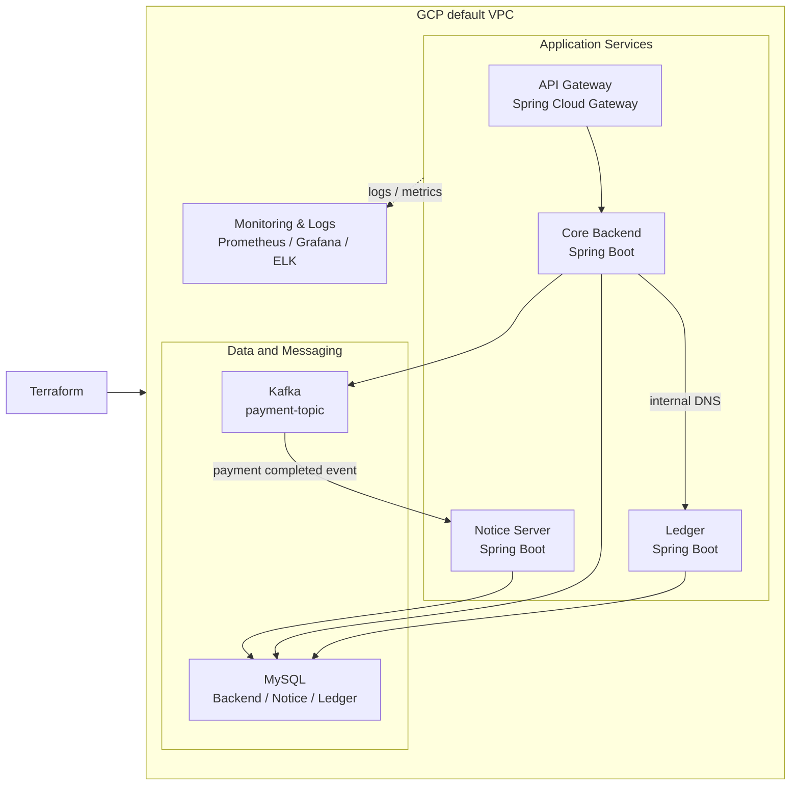

# Lesson Matching Platform Infrastructure

Lesson Matching Platform을 GCP에 배포하기 위한 Terraform 기반 인프라 저장소입니다. 애플리케이션 VM과 데이터베이스, 메시지 브로커, 결제 원장 서비스, 알림 서비스를 모듈 단위로 프로비저닝하고 서비스 간 연결 정보를 환경 변수로 주입합니다.

## What This Infrastructure Solves

- Gateway, Core Backend, Ledger, Notice 서비스를 독립적인 실행 단위로 구성
- Backend와 Ledger가 GCP 내부 DNS를 통해 통신하도록 서비스 주소를 주입
- 결제 완료 이벤트를 Kafka로 전달할 수 있는 메시징 기반 구성 제공
- Backend, Notice, Ledger용 MySQL 데이터베이스를 하나의 MySQL VM에서 분리 생성
- Secret Manager, IAM Service Account, Private DNS, 방화벽 규칙을 Terraform으로 관리
- Docker Compose 기반 VM 초기화와 서비스 실행 자동화

## Architecture



## Infrastructure Components

| Component | Responsibility | Terraform module |
| --- | --- | --- |
| API Gateway | External entry point and service routing | `modules/gateway` |
| Core Backend | Lesson, booking, payment business logic | `modules/spring` |
| Ledger | Payment ledger entry recording | `modules/spring` |
| Notice Server | Kafka consumer and notification delivery | `modules/spring` |
| MySQL | Backend, Notice, Ledger database storage | `modules/mysql` |
| Kafka | Payment completion event transport | `modules/kafka` |
| Logstash | Application log collection | `modules/logstash` |
| Elasticsearch | Centralized log storage and search | `modules/elasticsearch` |
| Prometheus / Grafana / Kibana | Metrics collection and visualization | `modules/monitoring` |

각 컴포넌트는 Google Compute Engine VM에서 Docker Compose로 실행됩니다. 애플리케이션 서비스는 공통 Spring 모듈을 재사용하고 서비스별 Docker 이미지와 환경 변수만 다르게 주입합니다.

## Service Connectivity

서비스 주소는 `infra.tf`의 local 값으로 관리합니다.

```hcl
backend_service_host = "lesson-backend.${zone}.c.${project_id}.internal"
ledger_service_host  = "lesson-ledger.${zone}.c.${project_id}.internal"
```

Terraform은 다음 연결 정보를 각 서비스에 전달합니다.

- Gateway → Backend, Ledger, Notice
- Backend → MySQL, Kafka, Ledger
- Notice → MySQL, Kafka
- Ledger → MySQL

특히 Backend의 `LEDGER_HOST`에는 Ledger의 내부 DNS 주소가 주입됩니다. 결제 완료 시 Backend가 공용 IP가 아닌 GCP 내부 네트워크의 Ledger 엔드포인트를 사용하도록 구성한 부분입니다.

`main.tf`에서는 `${var.environment}.internal` Private Managed Zone을 생성하고 Elasticsearch를 위한 `es-log` 내부 레코드를 등록합니다. 서비스 VM 간 통신에는 GCP 내부 DNS 호스트명을 사용합니다.

## Terraform Structure

```text
terraform/
├── main.tf                 # GCP provider, NAT, Private DNS, IAM
├── infra.tf                # 공통 인프라, MySQL/Kafka/Elasticsearch, DB 초기화
├── service.tf              # Gateway/Backend/Notice/Ledger 서비스 조립
├── firewall.tf             # 서비스 포트와 VM target tag 기반 방화벽
├── variables.tf            # project, region, environment 등 입력 변수
├── modules/
│   ├── common/              # Docker 설치 및 VM 공통 초기화
│   ├── gateway/             # Gateway VM과 Docker Compose
│   ├── spring/              # Backend/Notice/Ledger 공통 VM 모듈
│   ├── mysql/               # MySQL과 mysqld-exporter
│   ├── kafka/               # Kafka KRaft, topic 초기화, exporter
│   ├── logstash/            # 로그 수집 파이프라인
│   ├── elasticsearch/       # 로그 검색 저장소
│   └── monitoring/          # Prometheus, Grafana, Kibana
└── archive/                 # 이전 인프라 구성 보관
```

`service.tf`의 `depends_on`을 사용해 서비스 실행에 필요한 기반 인프라가 먼저 준비되도록 구성했습니다. MySQL VM 생성 후에는 `local-exec`로 Backend, Notice, Ledger 데이터베이스를 생성하고 Ledger 데이터베이스에 필요한 권한을 설정합니다.

## Security and Configuration

- MySQL root password는 GCP Secret Manager의 `DB_PASSWORD`에서 읽습니다.
- VM 전용 Service Account에 DNS 조회, Artifact Registry 이미지 pull, Secret Manager 접근, Firebase Cloud Messaging 권한을 부여합니다.
- 서비스 컨테이너에는 애플리케이션 이미지와 환경별 연결 정보만 주입합니다.
- Docker Compose와 Terraform 변수 파일에는 비밀값을 직접 저장하지 않도록 구성합니다.
- `terraform.tfvars`, `.tfstate`, 서비스 인증 정보는 원격 저장소에 올리지 않아야 합니다.

현재 방화벽 규칙은 개발·검증 편의를 위해 일부 포트를 `0.0.0.0/0`에 열어둔 상태입니다. 운영 환경에서는 내부 VPC 통신과 필요한 관리 접근만 허용하도록 source range와 target tag를 제한해야 합니다.

## Prerequisites

- Terraform 1.x 이상
- Google Cloud CLI (`gcloud`)
- GCP 프로젝트와 결제 계정
- Compute Engine, Cloud DNS, Secret Manager, Artifact Registry, Firebase Cloud Messaging API

GCP 인증:

```bash
gcloud auth login
gcloud auth application-default login
gcloud config set project <GCP_PROJECT_ID>
```

`terraform.tfvars` 예시:

```hcl
project_id       = "your-gcp-project-id"
region           = "asia-northeast3"
environment      = "dev"
username         = "your_ssh_username"
firebase_dry_run = true
```

## Apply

Terraform 실행 위치는 이 README가 있는 `terraform` 디렉터리입니다.

```bash
terraform init
terraform fmt -check
terraform validate
terraform plan
terraform apply
```

사용이 끝난 개발 환경은 과금 방지를 위해 정리합니다.

```bash
terraform destroy
```

`terraform apply` 과정에서 DB 생성용 `gcloud compute ssh`가 실행되므로 로컬 `gcloud` 인증과 해당 VM에 대한 SSH 권한이 필요합니다.

## Design Decisions

### VM + Docker Compose

개인 프로젝트 규모에서 Kubernetes 클러스터의 운영 비용과 복잡도를 줄이면서 GCP 네트워크, 방화벽, VM 초기화, 컨테이너 실행 과정을 직접 관리하기 위해 VM과 Docker Compose를 선택했습니다. 서비스가 늘어나도 Terraform 모듈과 서비스 조립 파일을 기준으로 확장할 수 있도록 구성했습니다.

### Internal DNS for Service-to-Service Calls

Backend와 Ledger처럼 결제 정합성에 직접 관여하는 서비스는 공용 주소를 거치지 않고 내부 DNS로 호출하도록 구성했습니다. 서비스 주소를 코드에 고정하지 않고 Terraform이 환경별 주소를 주입하므로 인프라 주소 변경과 애플리케이션 설정의 결합을 줄였습니다.

### Transactional Events with Kafka

결제 완료 후 알림 발송까지를 하나의 동기 요청으로 묶지 않고, Backend가 결제 완료 이벤트를 Kafka에 전달하고 Notice Server가 소비하도록 분리했습니다. 결제 처리와 외부 FCM 발송의 속도와 장애 영향을 분리할 수 있습니다.
